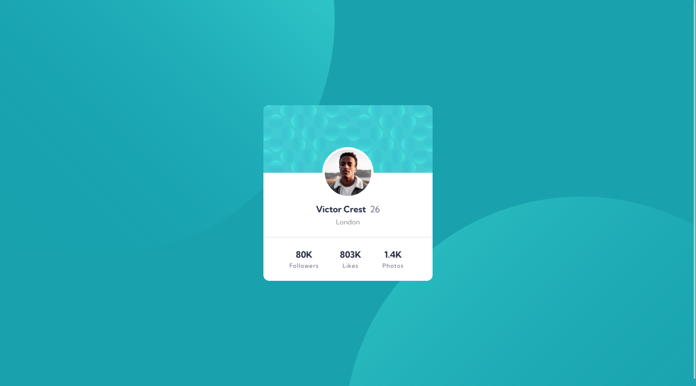
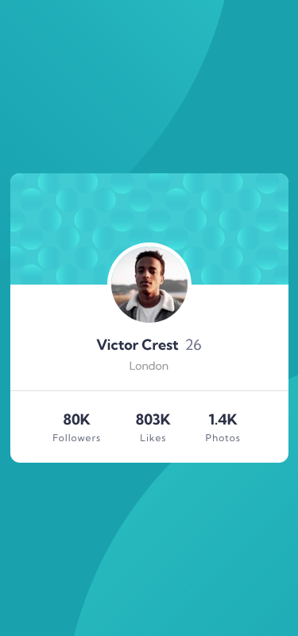

# Frontend Mentor - Profile card component solution

This is a solution to the [Profile card component challenge on Frontend Mentor](https://www.frontendmentor.io/challenges/profile-card-component-cfArpWshJ). Frontend Mentor challenges help you improve your coding skills by building realistic projects.

## Table of contents

- [Overview](#overview)
  - [The challenge](#the-challenge)
  - [Screenshot](#screenshot)
  - [Links](#links)
- [My process](#my-process)
  - [Built with](#built-with)
  - [What I learned](#what-i-learned)
- [Author](#author)

## Overview

This is a perfect challenge to test your layout skills. The card layout doesn't shift, so it's also great for those that haven't dived into responsive websites yet!

### The challenge

Your challenge is to build out this profile card component and get it looking as close to the design as possible.

- Build out the project to the designs provided

### Screenshot




### Links

- Solution URL: [https://github.com/mohamedKhaled89/profile-card-component]
- Live Site URL: [https://mohamedkhaled89.github.io/profile-card-component/]

## My process

### Built with

- Semantic HTML5 markup
- CSS custom properties
- Flexbox
- CSS Grid

### What I learned

I used separat tags to try to reach to background shape.

```html
<main>
  <div class="bg pattern-top"></div>
  <div class="bg pattern-bottom"></div>
</main>
```

```css
.pattern-top {
  position: absolute;
  content: url(../images/bg-pattern-top.svg);
  background-size: contain;
  background-repeat: no-repeat;
  top: -450px;
  left: -285px;
  z-index: -1;
}

.pattern-bottom {
  position: absolute;
  content: url(../images/bg-pattern-bottom.svg);
  background-size: contain;
  background-repeat: no-repeat;
  bottom: -585px;
  right: -250px;
  z-index: -1;
}

@media (max-width: 1200px) {
  .pattern-top {
    top: -610px;
    left: -680px;
  }

  .pattern-bottom {
    bottom: -610px;
    right: -680px;
  }
}
```

## Author

- Frontend Mentor - [@mohamedKhaled89](https://www.frontendmentor.io/profile/mohamedKhaled89)
